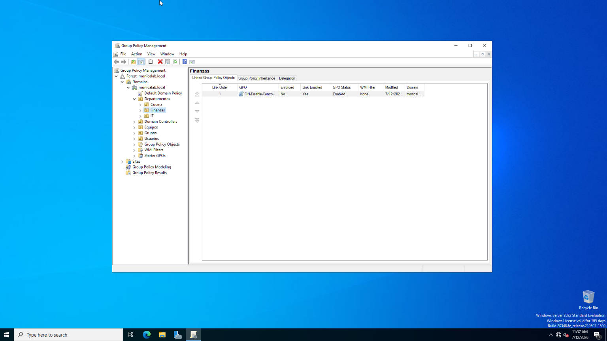
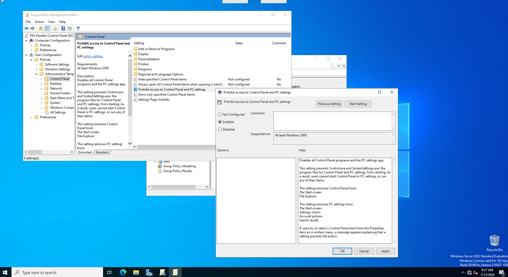
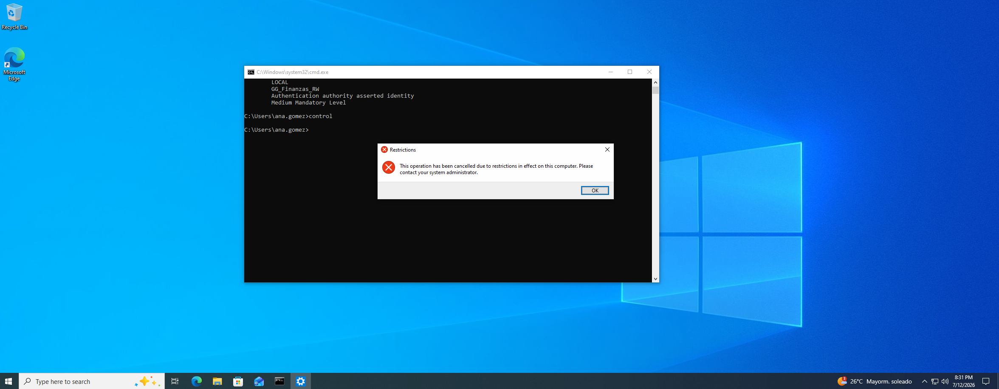
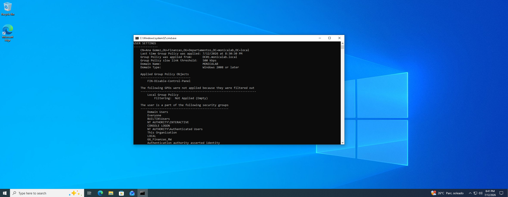

# Group Policy Lab

## Overview

This lab demonstrates how to create, link, configure, test, and troubleshoot a Group Policy Object in an Active Directory environment.

The policy prevents users in the Finance department from accessing Control Panel and Windows Settings.

## Lab Environment

- Domain: `monicalab.local`
- Domain Controller: `DC01`
- Server: Windows Server 2022
- Client: `W11-CL01`
- Test user: `Ana Gomez`
- Target OU: `Departamentos/Finanzas`

## Group Policy Object

- GPO name: `FIN-Disable-Control-Panel`
- Linked OU: `Finanzas`
- Policy type: User Configuration
- Policy state: Enabled

Policy path:

```text
User Configuration
└── Policies
    └── Administrative Templates
        └── Control Panel
            └── Prohibit access to Control Panel and PC settings
```

## Implementation

1. Opened Group Policy Management using `gpmc.msc`.
2. Created the GPO `FIN-Disable-Control-Panel`.
3. Linked the GPO to the `Finanzas` OU.
4. Enabled the Control Panel restriction.
5. Updated Group Policy on the client:

```cmd
gpupdate /force
```

6. Logged off and signed back in as:

```text
MONICALAB\ana.gomez
```

7. Verified the applied policies:

```cmd
gpresult /r
```

8. Tested the restriction:

```cmd
control
```

Windows successfully blocked access to Control Panel.

## Troubleshooting

Initially, the policy did not apply because Ana Gomez was located in the `Usuarios` OU instead of the `Finanzas` OU.

The original location was:

```text
CN=Ana Gomez,OU=Usuarios,DC=monicalab,DC=local
```

The user was moved to:

```text
CN=Ana Gomez,OU=Finanzas,OU=Departamentos,DC=monicalab,DC=local
```

After running `gpupdate /force` and logging in again, the GPO applied successfully.

## Evidence

### 1. GPO linked to the Finance OU



### 2. Control Panel policy enabled



### 3. Control Panel blocked on the client



### 4. GPO verified with gpresult



## Skills Demonstrated

- Active Directory OU management
- Group Policy creation and linking
- User Configuration policies
- Group Policy troubleshooting
- `gpupdate`
- `gpresult`
- Distinguished Name interpretation
- Windows client policy validation